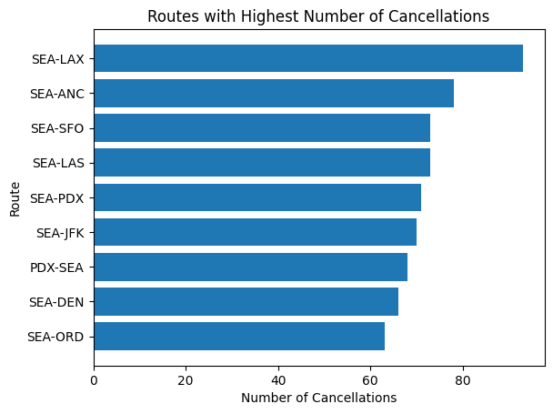
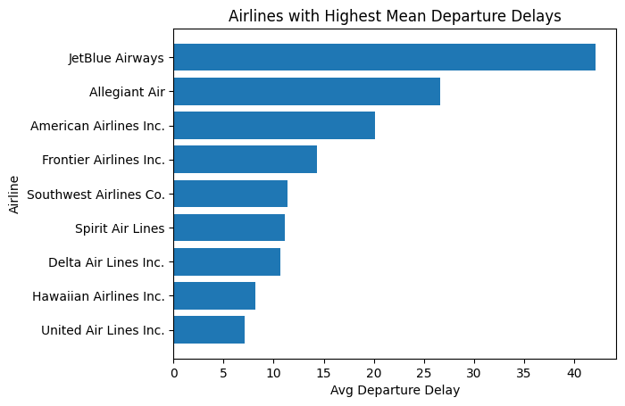

# Flight Delays & Cancellations Analysis Project

> **Goal:** Analyse 2022 U.S. flight and weather data to identify the routes and airlines with the highest cancellation rates and departure delays, and to assess how wind conditions affect on-time performance.

---

## 🧭 Overview

This project explores flight performance in 2022 using two datasets:

- **`flights2022.csv`** — containing flight schedule, departure, and cancellation information.  
- **`flights_weather2022.csv`** — including weather metrics such as wind gust and visibility.

Using **Python (pandas, matplotlib)**, I:

- Created route-level and airline-level aggregates for average departure delays and cancellation counts.  
- Visualized the most delayed and most canceled routes and airlines.  
- Examined the impact of **wind gusts (≥ 10 mph)** on departure delays.

---

## 📊 Key Questions

1. Which routes experience the most cancellations?  
2. Which airlines have the highest average departure delays?  
3. Is there a measurable relationship between wind gusts and departure delays?

---

## ⚙️ Data Preparation

### Step 1: Load and Inspect Datasets

```python
flights = pd.read_csv('CSV_files/flights2022.csv')
weather = pd.read_csv('CSV_files/flights_weather2022.csv')
```

### Step 2: Feature Engineering

- Created a **route** column combining `origin` and `dest`.  
- Added a **cancelled** column for missing departure times (`dep_time`).

### Step 3: Aggregations

Calculated:

- `avg_dep_delay` → mean departure delay  
- `cancelled_count` → number of cancellations  

Performed separate aggregations for **routes** and **airlines**.

---

## 📈 Visual Analysis

### 1. Routes with Highest Number of Cancellations

The plot below highlights the **top 9 routes** with the most cancellations:



---

### 2. Airlines with Highest Average Departure Delays

The next chart shows the **top 9 airlines** by mean departure delay:



---

## 🌬️ Wind Impact Analysis

To evaluate weather effects, wind gusts ≥ 10 mph were labeled as **windy**:

```python
weather['windy'] = weather['wind_gust'] >= 10
```

Average departure delays were compared between windy and calm conditions:

```python
avg_delay_by_wind = weather.groupby(['origin', 'windy'])['dep_delay'].mean().reset_index()
pivot = avg_delay_by_wind.pivot(index='origin', columns='windy', values='avg_dep_delay')
```

If `wind_response = True`, it indicates that every origin airport had higher average delays under windy conditions — confirming a **negative correlation between strong winds and departure punctuality**.

---

## 🧩 Findings

| Insight | Observation |
| :-- | :-- |
| **Top Route Cancellations** | The SEA–LAX route saw the highest number of cancellations, followed by SEA–ANC and SEA–SFO. |
| **Top Airline Delays** | JetBlue Airways and Allegiant Air recorded the highest average departure delays among major carriers. |
| **Weather Effect** | Most airports showed longer delays during windy conditions, confirming that wind gusts significantly impact flight punctuality. |

---

## 🛠️ Technologies Used

| Category | Tools |
| :-- | :-- |
| Data Analysis | Python, Pandas, Matplotlib |
| Data Sources | `flights2022.csv`, `flights_weather2022.csv` |
| Outputs | Aggregated tables, visual charts, wind impact analysis |

---

## 👤 Author

**Sevban Eksi**  
[GitHub](https://github.com/st3kin) 
